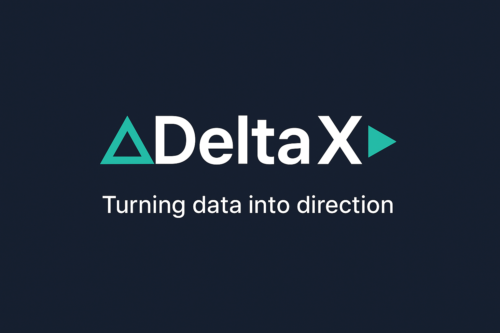

<!-- Banner -->

  

# 👋 Hi, I'm Victor — also known as **DeltaX**

> "ΔX" — because transformation starts with change.

I'm a **Data & Analytics Professional** passionate about uncovering insights that drive better decisions.  
With a foundation in **Mathematics** and **Data Science**, I thrive at the intersection of **data, logic, and impact** — turning raw information into actionable intelligence.

---

### 🧠 What I Do
- 📊 **Data Analysis & Visualization** — uncovering trends and patterns through Power BI, Python, and SQL.  
- 🤖 **Machine Learning & Predictive Modeling** — applying data-driven methods to solve real-world problems.  
- 🧩 **Problem Solving** — breaking down complex challenges into structured, data-backed solutions.

---

### 🧰 Tech Stack

---

### 🚀 Featured Projects
- 🌡️ **[Temperature Anomaly Detection]([https://github.com/Victorkiosh/temperature-anomaly-detection](https://github.com/Victorkiosh/temperature_anomaly_detection))** — End-to-end machine learning project: from data collection to model deployment and dashboard monitoring.  
- ⚡ **[Dominion Electricity Anomaly Detection](https://github.com/Victorkiosh/dominion-electricity-anomaly-detection)** — Detecting unusual electricity consumption patterns using ML techniques.  
- 🧩 **[Customer Segmentation (RFM Analysis)](https://github.com/Victorkiosh/customer-segmentation-rfm-powerbi)** — Understanding customer behavior through clustering and Power BI storytelling.
- 🛒 **[KituHub E-Commerce Dashboard](https://github.com/Victorkiosh/kituhub-powerbi)** — A Power BI sales & customer insights dashboard telling a story of growth and performance.  

---

### 💬 Let's Connect

---

### ✨ About DeltaX
I believe every dataset has a story — and every story deserves to be told with clarity and purpose.  
**DeltaX** represents the mindset I bring to every project: curiosity, adaptability, and continuous transformation.

---

⭐ *"Turning data into direction — and direction into impact."*
